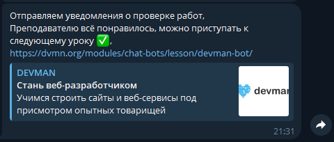

# Телеграм-бот для отправки уведомлений о проверке работ
Бот использует API при помощи long polling, получая информацию о правильном или неправильном выполнении задания.

## Запуск
1. Установите необходимые зависимости командой:
```
pip install -r requirements.txt
```
2. Создайте своего бота через `Bot-Father`
3. В файлы окружения введите 

`NOTIFICATION_BOT_TOKEN` - для отправки уведомления о проверке работы,
`ALLERT_BOT_TOKEN` - для отправки сообщений об ошибке в работе бота, 
`DVMN_TOKEN`, 
`CHAT_ID` - для отправки уведомления о проверке работы,
`ADMIN_CHAT_ID` - для отправки сообщений об ошибке в работе бота
4. Запускаем бота, из директории проекта, командой
```
python dvmn_bot_notifier.py
```

### Вид отправленного уведомления о проверке
